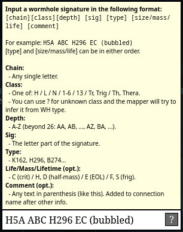

# Avanto Fastmapper

This userscript adds a simple text input box to Avanto Tripwire
to facilitate quickly adding new wormhole connections without
using the mouse.

# Installation

1. Install [Violentmonkey](https://violentmonkey.github.io/) or Tampermonkey or some other userscript manager.
2. Install the userscript from [this link](https://raw.githubusercontent.com/brndd/avanto-tripwire-fastmap/refs/heads/master/avanto_fastmap.user.js).
3. Refresh Tripwire.
4. Press **Alt-S** (**Ctrl-Cmd-S**) to open the input box.

# Usage

Install the userscript. The quick input box can be opened with the shortcut **Alt-S** (**Ctrl-Cmd-S** on Mac) (the S stands for "sig"). The shortcut currently cannot be changed.

The box looks like this with the syntax help open. The syntax view is hidden by default though.

# Building

Run `npm run build`. The userscript will be generated into the root of the repo as avanto_fastmap.user.js.

# Editing

Make your edits to the userscript in src/avanto_fastmap.js and to the grammar in src/avanto.pegjs.

The build process combines the userscript template file with the generated grammar to produce the final userscript.

# Updating

Bumping the version number in src/avanto_fastmap.js, rebuilding and committing the built userscript will
cause Violentmonkey (or whatever addon you use) to auto-update the userscript.
